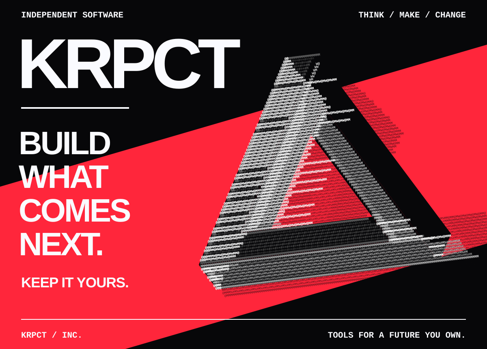
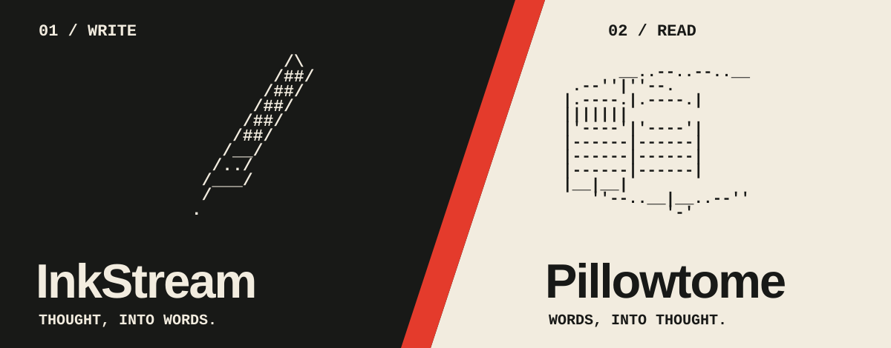

# KRPCT

**We build tools for a future you own.**

<p align="center">
  
</p>

Software for thinking, creating, and working with machines.
Built around a simple conviction: the tools that shape your work should leave you in control.

[Explore the repositories](https://github.com/orgs/KRPCT/repositories?type=source) · [Meet the projects](#the-work) · [Build with us](#build-with-us)

## Software, on your terms.

The next generation of software should give people more room to act.
More room to make things, change them, and take them somewhere new.

We start with the work in front of us: a page to write, a book to read, an idea worth building.

## The work

<p>
  
</p>

### [InkStream](https://github.com/KRPCT/InkStream)

A desktop home for serious writing. Three editing modes, Git history, citations, linked notes, and mathematical typesetting.

### [Pillowtome](https://github.com/KRPCT/Pillowtome)

A local-first reader for Windows and Android, with Chinese text conversion, annotations, in-book search, and self-hosted WebDAV sync.

[See the rest of our work →](https://github.com/orgs/KRPCT/repositories?type=source)

## Built to be yours

```text
        .------------.
       /            /|
      +------------+ |
      | YOUR IDEAS | +
      | YOUR TOOLS |/
      +------------+
             |
             +----> YOUR WORK
                        |
        WHAT COMES NEXT <+
```

We care about software you can understand, workflows you can change, and work you can carry with you. That is the direction we build toward.

## Build with us

Start with a project. Read its docs. Open an issue with something concrete: a question, a rough edge, or a better way to do the work. Follow its contribution and license terms when making changes.

[InkStream issues](https://github.com/KRPCT/InkStream/issues) · [Pillowtome issues](https://github.com/KRPCT/Pillowtome/issues)

```text
  +--------------------------->
  | THE NEXT SHAPE IS OPEN.
  +--------------------------->
```

<details>
<summary>The mark, in plain text</summary>

The Penrose triangle is our reminder to look again. Three beams. One continuous loop. A shape that asks for another way of seeing.

[Penrose ASCII source](../assets/readme/penrose.txt) · [KRPCT ASCII wordmark](../assets/readme/wordmark.txt) · [Pen and book ASCII](../assets/readme/work.txt)

</details>
